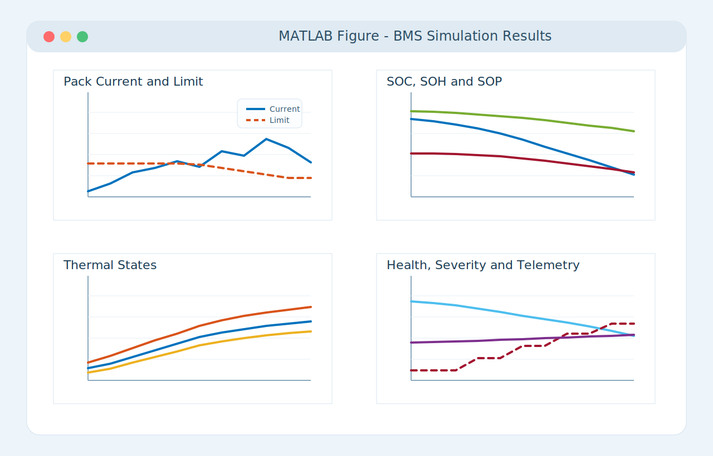
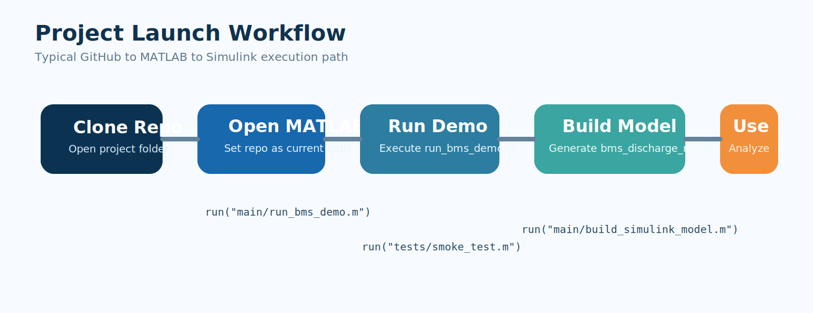
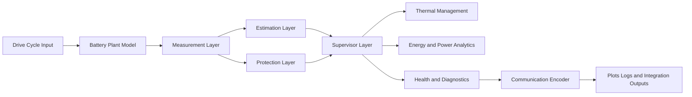
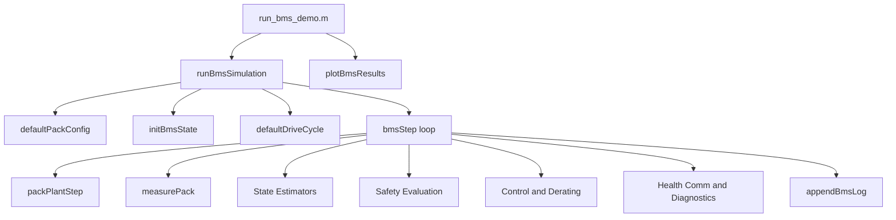

# Battery Management System in MATLAB and Simulink

<p align="center">
  
</p>

<p align="center">
  A professional MATLAB and Simulink Battery Management System repository for lithium-ion battery simulation, protection, supervisory control, thermal monitoring, energy analytics, health scoring, and communication-oriented telemetry.
</p>

<p align="center">
  
  
  
  
</p>

## Description

This repository delivers a complete **Battery Management System (BMS)** development baseline built with **MATLAB** and **Simulink**. It combines a modular MATLAB simulation workflow with a code-generated Simulink architecture so the project can serve both:

- research and academic battery-system studies
- rapid prototyping of protection and supervisory logic
- documentation-ready project presentation on GitHub
- extension into larger EV or stationary energy-storage BMS programs

The current implementation is centered on a **Kokam 31 Ah lithium-ion cell** and emphasizes a discharge-focused operating scenario. On top of the core plant and safety logic, the repository includes dynamic derating, state estimation, thermal supervision, health scoring, and CAN-style telemetry encoding.

## Repository Highlights

- MATLAB simulation path with reusable subsystem functions
- Simulink model generation from `main/build_simulink_model.m`
- Protection logic for under-voltage, over-current, and thermal events
- SOC, SOH, and SOP estimation paths
- Core and surface thermal modeling
- Energy, power, loss, and estimated range analytics
- Fault severity classification and supervisor mode logic
- Communication-style frame generation for telemetry outputs
- GitHub-ready diagrams, banner artwork, and professional simulation figure visuals

## Visual Overview

### Repository Banner

<p align="center">
  
</p>

### Simulation Figure Overview

<p align="center">
  
</p>

### Architecture Overview

<p align="center">
  
</p>

### Launch Workflow Diagram

<p align="center">
  
</p>

### Performance Results Overview

<p align="center">
  
</p>

## System Architecture

### Functional Layers



### MATLAB Execution Flow



### Generated Simulink Blocks

The generated model currently includes the following high-level functional blocks:

- `CellModel`
- `BatterySupervisor`
- `ThermalManager`
- `EnergyEstimator`
- `HealthMonitor`
- `CommEncoder`
- `SystemScope`

## Launching the Project

### 1. Run the MATLAB simulation

```matlab
run("main/run_bms_demo.m");
```

### 2. Generate the Simulink model

```matlab
run("main/build_simulink_model.m");
```

### 3. Run the smoke test

```matlab
run("tests/smoke_test.m");
```

## Project Structure

```text
Battery mangement System/
|- config/
|  \- defaultPackConfig.m
|- docs/
|  \- assets/
|     |- architecture-overview.svg
|     |- launch-workflow.svg
|     |- matlab-figure.svg
|     |- repo-banner.svg
|     \- results-graphs.svg
|- main/
|  |- build_simulink_model.m
|  \- run_bms_demo.m
|- src/
|  |- communication/
|  |- control/
|  |- estimators/
|  |- models/
|  |- safety/
|  |- utils/
|  \- visualization/
|- tests/
|  \- smoke_test.m
|- CONTRIBUTING.md
|- LICENSE
|- README.md
\- .gitignore
```

## Core Files

### Entry Points

- `main/run_bms_demo.m`
- `main/build_simulink_model.m`
- `tests/smoke_test.m`

### Configuration

- `config/defaultPackConfig.m`

### Simulation Core

- `src/runBmsSimulation.m`
- `src/bmsStep.m`
- `src/initBmsState.m`
- `src/models/packPlantStep.m`
- `src/models/measurePack.m`

### Major Subsystems

- `src/control/`
- `src/estimators/`
- `src/safety/`
- `src/communication/`
- `src/utils/`
- `src/visualization/`

## Cell Baseline

| Parameter | Value |
|---|---:|
| Cell Type | Kokam Lithium-Ion |
| Capacity | 31 Ah |
| Nominal Voltage | 3.7 V |
| Maximum Voltage | 4.2 V |
| Cutoff Voltage | 2.7 V |
| Continuous Discharge Current | 155 A |
| Peak Discharge Current | 310 A |
| Discharge Temperature Range | -20 C to 60 C |

## Outputs and Analytics

The MATLAB workflow and generated diagrams are designed to expose:

- pack voltage and current behavior
- current limit and derating behavior
- SOC, SOH, and SOP trends
- core, surface, and blended thermal states
- remaining energy, throughput, and estimated range
- health score and penalty contributors
- supervisor mode and fault severity
- communication-oriented raw telemetry values

## Documentation Assets

Repository visuals are stored in `docs/assets/`:

- `repo-banner.svg`
- `architecture-overview.svg`
- `launch-workflow.svg`
- `results-graphs.svg`
- `matlab-figure.svg`

## Professional Summary

This project can be presented as a professional MATLAB and Simulink BMS repository for battery-system modeling, supervisory protection, thermal and energy analytics, and communication-oriented software prototyping. It is structured to be readable on GitHub, extensible in MATLAB, and suitable as a foundation for more advanced battery-pack and EV control work.

## Roadmap

- Add charging path and charger state machine
- Extend to multi-cell or multi-module pack balancing
- Add EKF or UKF based state estimation
- Add richer communication groups and diagnostics reporting
- Add fault injection scenarios and result export
- Add HIL-friendly interfaces and report automation

## Notes

- Current sign convention is positive for discharge.
- The included figure and logo-style artwork are custom repository visuals and are not official MathWorks branding.
- The Simulink model is generated from code so the repository stays text-reviewable.
- This repository is a professional development baseline, not a production-certified automotive BMS.

## License

Released under the [MIT License](LICENSE).
