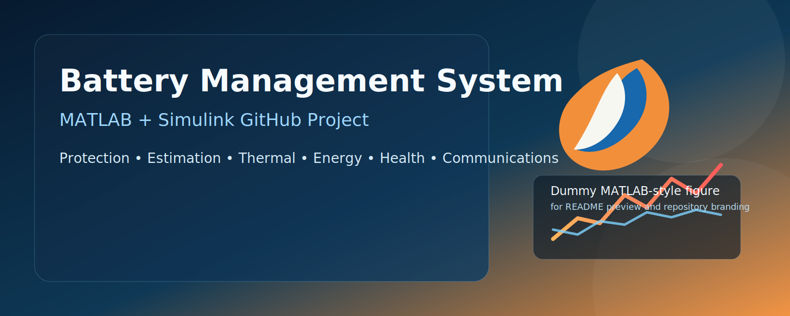
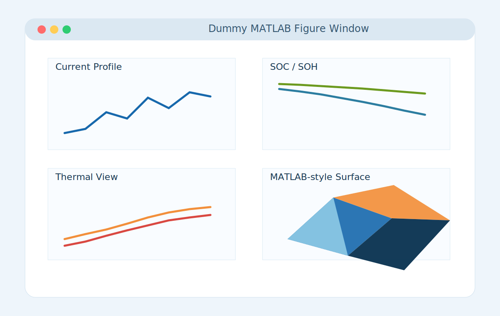
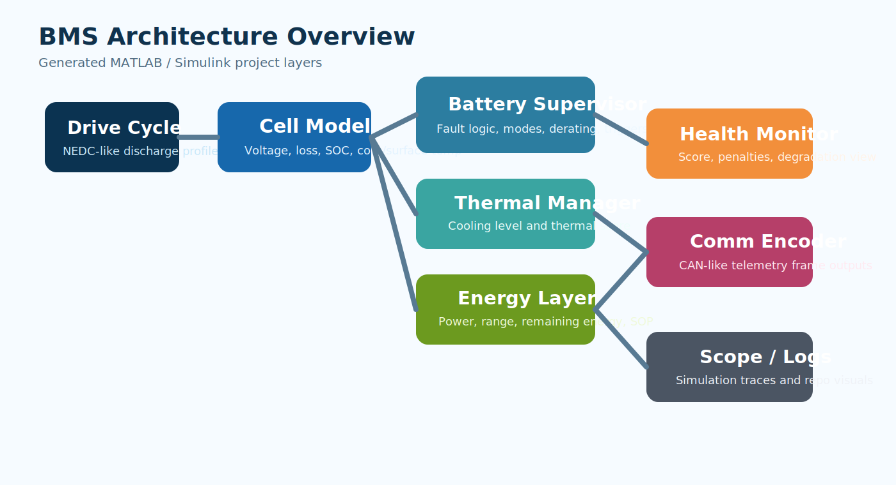
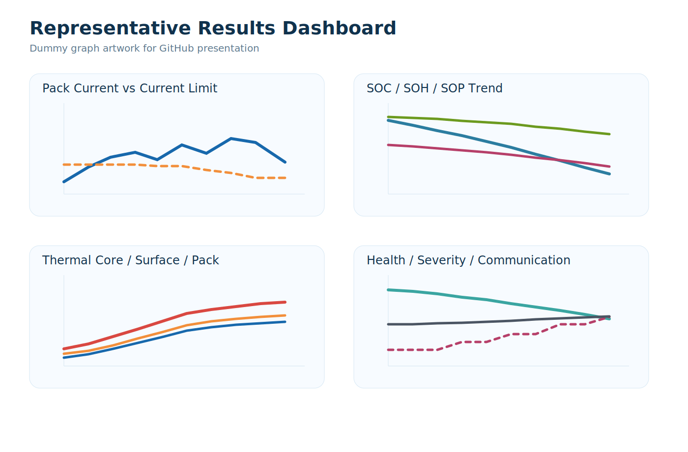
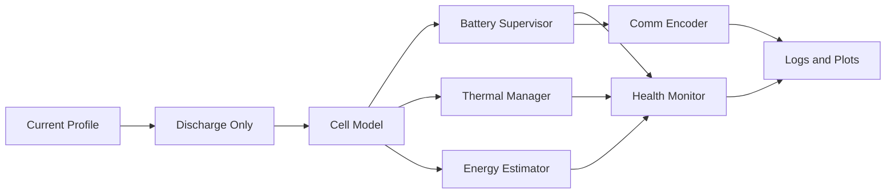
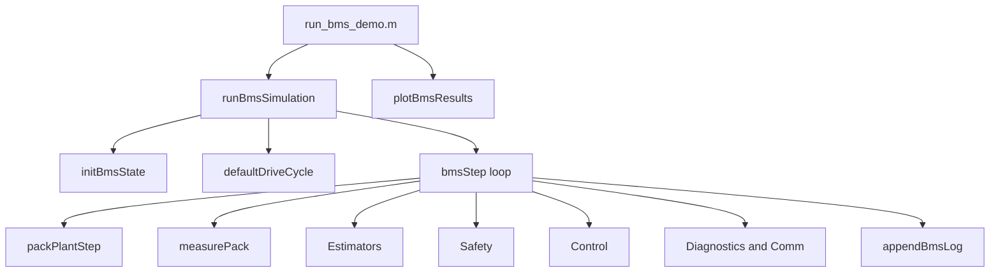

# Battery Management System in MATLAB and Simulink

<p align="center">
  
</p>

<p align="center">
  A GitHub-ready Battery Management System project with MATLAB simulation, generated Simulink architecture, protection logic, estimation, thermal supervision, health scoring, and communication-style telemetry.
</p>

<p align="center">
  
  
  
  
</p>

## Overview

This repository packages an end-to-end **Battery Management System (BMS)** workflow for **MATLAB and Simulink**. It started from a discharge-protection tutorial concept and has been expanded into a larger project structure with:

- plant simulation
- protection and supervisory logic
- SOC, SOH, and SOP estimation
- thermal management
- energy and range estimation
- health scoring
- CAN-style communication payload generation
- a code-generated Simulink model for system-level exploration

The current baseline uses a **Kokam 31 Ah lithium-ion cell** and a discharge-oriented operating scenario.

## Repository Preview

### Dummy MATLAB Figure

This repository includes a **dummy MATLAB-style figure asset** for GitHub presentation and documentation previews.

<p align="center">
  
</p>

### Architecture Diagram

<p align="center">
  
</p>

### Representative Graphs

<p align="center">
  
</p>

## Features

- NEDC-like discharge current profile
- Single-cell equivalent-circuit battery model
- Under-voltage, over-current, and thermal protection
- Discharge trigger and safe current gating
- Dynamic current derating
- Core and surface thermal states
- Pack power, loss power, and remaining energy tracking
- Estimated range and throughput accumulation
- State-of-power estimation
- Health score with penalties
- Fault severity classification
- Supervisor mode management
- Communication frame encoding with raw telemetry fields
- Programmatic Simulink model generation

## Project Structure

```text
Battery mangement System/
├── config/
│   └── defaultPackConfig.m
├── docs/
│   └── assets/
│       ├── architecture-overview.svg
│       ├── matlab-dummy-figure.svg
│       ├── repo-banner.svg
│       └── results-graphs.svg
├── main/
│   ├── build_simulink_model.m
│   └── run_bms_demo.m
├── src/
│   ├── communication/
│   ├── control/
│   ├── estimators/
│   ├── models/
│   ├── safety/
│   ├── utils/
│   └── visualization/
├── tests/
│   └── smoke_test.m
├── CONTRIBUTING.md
├── LICENSE
├── README.md
└── .gitignore
```

## Kokam Cell Baseline

| Parameter | Value |
|---|---:|
| Capacity | 31 Ah |
| Nominal Voltage | 3.7 V |
| Maximum Voltage | 4.2 V |
| Cutoff Voltage | 2.7 V |
| Continuous Discharge Current | 155 A |
| Peak Discharge Current | 310 A |
| Discharge Temperature Range | -20 C to 60 C |

## System Architecture

### Functional Flow



### MATLAB Simulation Path



## Main MATLAB Files

Core entry points:

- [run_bms_demo.m](/d:/Battery%20mangement%20System/main/run_bms_demo.m)
- [build_simulink_model.m](/d:/Battery%20mangement%20System/main/build_simulink_model.m)
- [defaultPackConfig.m](/d:/Battery%20mangement%20System/config/defaultPackConfig.m)

Simulation core:

- [runBmsSimulation.m](/d:/Battery%20mangement%20System/src/runBmsSimulation.m)
- [bmsStep.m](/d:/Battery%20mangement%20System/src/bmsStep.m)
- [packPlantStep.m](/d:/Battery%20mangement%20System/src/models/packPlantStep.m)
- [measurePack.m](/d:/Battery%20mangement%20System/src/models/measurePack.m)

Major subsystems:

- Control: [src/control](/d:/Battery%20mangement%20System/src/control)
- Estimation: [src/estimators](/d:/Battery%20mangement%20System/src/estimators)
- Safety: [src/safety](/d:/Battery%20mangement%20System/src/safety)
- Communication: [src/communication](/d:/Battery%20mangement%20System/src/communication)
- Visualization: [src/visualization](/d:/Battery%20mangement%20System/src/visualization)

## Simulink Model

The repository stores the **generator script**, not a fixed `.slx` file. Run the script below to create the model:

```matlab
run("main/build_simulink_model.m");
```

It generates a Simulink model named:

```text
bms_discharge_model.slx
```

Generated subsystems include:

- `CellModel`
- `BatterySupervisor`
- `ThermalManager`
- `EnergyEstimator`
- `HealthMonitor`
- `CommEncoder`
- `SystemScope`

## Quick Start

Run the MATLAB demo:

```matlab
run("main/run_bms_demo.m");
```

Generate the Simulink model:

```matlab
run("main/build_simulink_model.m");
```

Run the smoke test:

```matlab
run("tests/smoke_test.m");
```

## Expected Outputs

The MATLAB demo and plotting stack are designed to expose:

- pack voltage and current
- current limit and derate behavior
- SOC, SOH, and SOP
- core, surface, and blended pack temperature
- remaining energy and estimated range
- health score and penalty contributors
- supervisor mode and fault severity
- communication-style raw telemetry fields

## Graphs Included in the README

The repository includes GitHub-friendly static SVG visualizations:

- [repo-banner.svg](docs/assets/repo-banner.svg)
- [architecture-overview.svg](docs/assets/architecture-overview.svg)
- [results-graphs.svg](docs/assets/results-graphs.svg)
- [matlab-dummy-figure.svg](docs/assets/matlab-dummy-figure.svg)

These are intentionally lightweight and portable so the README renders nicely on GitHub without requiring generated screenshots.

## Roadmap

- Add charging path and charger state machine
- Upgrade to multi-cell pack balancing
- Add advanced estimation such as EKF/UKF
- Introduce CAN database style message definitions
- Add fault replay scenarios and report export
- Add hardware-in-the-loop friendly interfaces

## Notes

- Current sign convention is positive for discharge.
- The MATLAB figure and logo artwork included here are **dummy repository visuals**, not official MathWorks branding.
- The Simulink model is generated from code to keep the repository reviewable in text form.
- This is a development and learning baseline, not a production-certified automotive BMS.

## License

This project is released under the [MIT License](LICENSE).
